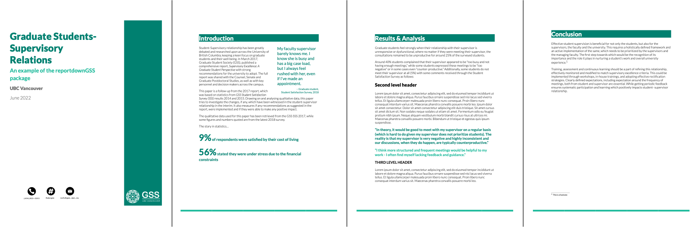

<!-- README.md is generated from README.Rmd. Please edit that file -->

# reportdownGSS

<!-- badges: start -->


<!-- badges: end -->

reportdownGSS was created for the [UBC Graduate Student
Society](https://gss.ubc.ca), specifically to be used be the current
Survey Coordinator/Data Analyst to create survey reports. Previously,
reports were created with design software (inDesign, illustrator). Click
[here](https://gss.ubc.ca/wp-content/uploads/2019/10/GSS.SupervisoryRelationsReport2019-FINAL.pdf)
to see a previous report created with Illustrator. There are several
issues with using design software. For example, it is not reproducible
and not everyone in this role will have access or know how to use such
software. RMarkdown was a potential solution, however, the document it
produces is very bland and unattractive. It was not appropriate for
presenting findings to GSS members and stakeholders across the
university.

To address the issues presented, **reportdownGSS** was developed. Using
the [pagedown](https://github.com/rstudio/pagedown) package and inspired
by the [pagedreport](https://github.com/rfortherestofus/pagedreport)
package, reportdownGSS uses CSS to create reproducible *and*
aesthetically pleasing reports. Only knowledge in Markdown and R is
needed to create a report worthy of being presented!

## Installation

You can install the development version of reportdownGSS from
[GitHub](https://github.com/) with:

``` r
# install.packages("devtools")
devtools::install_github("andr3wli/reportdownGSS")
```

## Example

Below are templates currently available.

### Light theme (`reportdownGSS::reportd_light`)

The light theme was created to look similar to
[this](https://gss.ubc.ca/wp-content/uploads/2019/10/GSS.SupervisoryRelationsReport2019-FINAL.pdf)
report. The skeleton template contains instructions and descriptions for
all the features.



### Contributing

Future GSS Survey Coordinators/Data Analysts please do not hesitate to
contact me if you have any questions. I welcome contributions especially
if you are familiar with CSS. Alternatively, if you have a nice design
in mind, I can try to recreate it with CSS and create a new template.

### Acknowledgement

This project was made possible by my amazing directors and colleagues at
the Graduate Student Society at UBC Vancouver. Furthermore, this package
uses the `html_paged` function from the pagedown package. Lastly, this
project was entirely inspired and developed from pagedreport package
from the team at [R for the Rest of Us](https://rfortherestofus.com).
